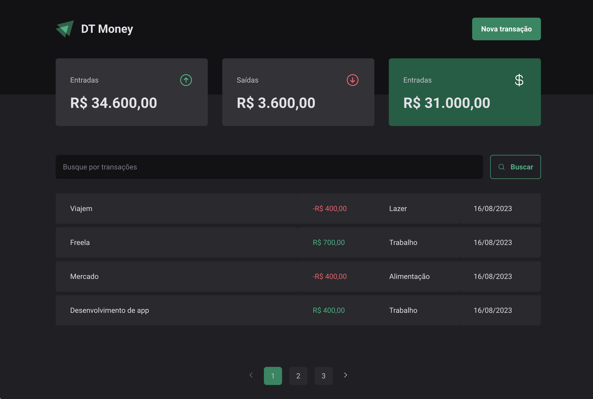

<h1 align="center">
  
</h1>


<h1 align="center">
    Dt Money
</h1>
<p align="center">Mange your finances 💲</p>

## About this project

This project was created during the second React Ignite module
Functionalities:
- Table of transactions
- Modal using Radix
- Forms with React Hook Form
- I have also added the pagination, check it out 😉

---

## Project UI 🎨

- [Figma - Dt Money](https://www.figma.com/community/file/1138814493269096792/DT-Money)

## Technologies 👩‍💻

Technologies used in this project

- [ReactJS](https://reactjs.org/)
- [TypeScript](https://www.typescriptlang.org/)
- [Radix-Dialog](https://www.radix-ui.com/primitives/docs/components/dialog)
- [Styled Components](https://styled-components.com/)
- [React Hook Form](https://react-hook-form.com/)
- [Zod](https://zod.dev/)
---

## Requirements 💻

It is necessary to have installed on your machine

- [Git](https://git-scm.com/)
- [Node](https://nodejs.org/en/)


## Starting 🚀

```bash
# Clone this project
$ git clone git@github.com:Artur-Ceschin/dt-money.git

# Access
$ cd dt-money

# Install dependencies
$ yarn

# Run the project
$ yarn dev
# The server will initialize in the <http://localhost:5173>

# Run JSON Server api mock
$ yarn dev:server
# The server will initialize in the <http://localhost:3000>

```

---

## License 📃

This project is under license from MIT. For more details, see the [LICENSE](./LICENSE.md) file.

### Author

---

Made with ❤️ by Artur Ceschin 👋🏼 Please fell free to contact me!
<br/>
[](https://www.linkedin.com/in/artur-peres-ceschin-programador/)
[](mailto:artur.ceschin@gmail.com)